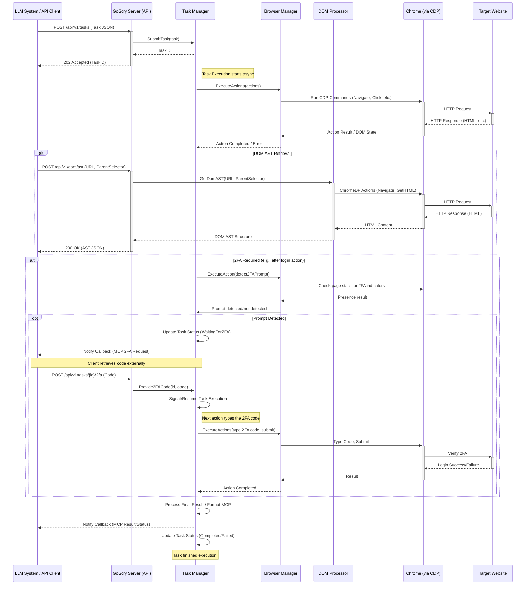

# GoScry

<p align="center">
  
</p>

GoScry is a server application written in Go that acts as a bridge between a controlling system (like an LLM or script) and a web browser. It uses the Chrome DevTools Protocol (CDP) to interact with websites based on tasks submitted via its API. GoScry can perform actions like navigation, clicking, typing, handling authentication (with hooks for 2FA), and extracting DOM content. Results and status updates can be reported back via webhooks using the Model Context Protocol (MCP) format.

## Features

* **Remote Browser Control:** Uses CDP (via `chromedp`) to control headless or headed Chrome/Chromium instances.
* **Task-Based API:** Submit sequences of browser actions (navigate, click, type, wait, get DOM, screenshot, etc.) via a simple JSON API.
* **Authentication Handling:** Supports basic username/password login sequences within tasks.
* **2FA Support (Manual Hook):** Detects potential 2FA prompts and signals back via API/callback, allowing an external system or user to provide the code to continue the task.
* **DOM Extraction:** Retrieve full HTML, text content, or a simplified version of the DOM.
* **DOM AST:** Generate a structured Abstract Syntax Tree representation of the DOM with optional scope control.
* **MCP Output:** Formats asynchronous results/status updates (e.g., via callbacks) according to the Model Context Protocol (spec 2025-03-26) for clear, structured context reporting.
* **Configurable:** Manage server port, browser settings, logging, and security via a YAML file or environment variables.

## Architecture Diagram



## Package Structure

* **cmd/goscry:** Main application entry point
* **internal/taskstypes:** Core data types shared across packages
* **internal/tasks:** Task management and execution
* **internal/browser:** Browser control and CDP interactions
* **internal/server:** HTTP API handlers
* **internal/config:** Configuration handling
* **internal/dom:** DOM processing utilities

## Prerequisites

* **Go:** Version 1.21 or later.
* **Chrome / Chromium:** A compatible version installed on the system where GoScry will run. Ensure the browser executable is in the system PATH or provide the path in the configuration.

## Installation

1.  Clone the repository:
    ```bash
    git clone https://github.com/copyleftdev/goscry.git
    cd goscry
    ```
2.  Build the executable:
    ```bash
    go build -o goscry ./cmd/goscry/
    ```
    This will create the `goscry` binary in the project root.

3.  Alternatively, download a pre-built binary from the [releases page](https://github.com/copyleftdev/goscry/releases).

## Docker Deployment

GoScry can be easily deployed using Docker and Docker Compose with a variety of deployment options.

### Quick Start with Docker

1. Clone the repository:
   ```bash
   git clone https://github.com/copyleftdev/goscry.git
   cd goscry
   ```

2. Start the container:
   ```bash
   docker compose up -d
   ```

3. Access the API at http://localhost:8090

### Deployment Options

GoScry provides several pre-configured deployment profiles:

1. **Basic Deployment** - Just the GoScry service:
   ```bash
   docker compose up -d
   ```

2. **Production Deployment** - Includes Traefik reverse proxy with TLS termination:
   ```bash
   docker compose --profile production up -d
   ```

3. **Monitoring Deployment** - Adds Prometheus and Grafana for observability:
   ```bash
   docker compose --profile monitoring up -d
   ```

### Docker Configuration

- **Environment Variables**: Configure the service using environment variables:
  - `GOSCRY_API_KEY`: API key for authentication
  - `LOG_LEVEL`: Logging level (debug, info, warn, error)
  - `AUTO_GENERATE_API_KEY`: Auto-generate a secure API key

- **Volumes**: The Docker setup includes persistent volumes for:
  - Configuration data
  - Prometheus metrics (when using monitoring profile)
  - Grafana dashboards (when using monitoring profile)

For detailed Docker deployment instructions, see [DOCKER.md](DOCKER.md).

## Continuous Integration and Deployment

GoScry uses GitHub Actions for CI/CD:

- Automated testing on each push to main and pull request
- Automated binary builds for Linux, macOS (Intel and ARM), and Windows
- Automatic releases when a version tag is pushed (e.g., `v1.0.0`)

For detailed information about the release process, see [RELEASING.md](RELEASING.md).

## Configuration

GoScry is configured via a `config.yaml` file or environment variables.

1.  Copy the example configuration:
    ```bash
    cp config.example.yaml config.yaml
    ```
2.  Edit `config.yaml` to suit your environment:
    * `server.port`: Port the API server listens on.
    * `browser.executablePath`: Absolute path to the Chrome/Chromium executable (leave empty to attempt auto-detect).
    * `browser.headless`: `true` to run headless, `false` for headed mode.
    * `browser.userDataDir`: Path to a persistent user profile directory (optional, creates temporary profile if empty).
    * `browser.maxSessions`: Maximum concurrent browser instances.
    * `log.level`: Logging level (`debug`, `info`, `warn`, `error`).
    * `security.allowedOrigins`: List of origins allowed for CORS requests. Use specific domains in production instead of `*`.
    * `security.apiKey`: A secret key required for API access (set via `GOSCRY_SECURITY_APIKEY` environment variable for better security).

Environment variables override file settings. They are prefixed with `GOSCRY_` and use underscores instead of dots (e.g., `GOSCRY_SERVER_PORT=9090`, `GOSCRY_SECURITY_APIKEY=your-secret-key`).

## Running the Server

```bash
./goscry -config config.yaml
```

Or, if using environment variables primarily:

```bash
export GOSCRY_SECURITY_APIKEY="your-secret-key"
# export GOSCRY_BROWSER_EXECUTABLEPATH="/path/to/chrome" # Optional
./goscry
```

The server will start and log output to the console based on the configured log level.

## API Usage

The API listens on the configured port (default 8080) under the `/api/v1` path prefix. Authentication via `X-API-Key` or `Authorization: Bearer <key>` header is required if `security.apiKey` is set.

### Endpoints

* **`POST /api/v1/tasks`**: Submit a new browser task.
    * **Request Body:** `SubmitTaskRequest` JSON (see `internal/server/handlers.go`). Includes `actions`, optional `credentials`, `two_factor_auth` info, and `callback_url`.
    * **Response (Success):** `202 Accepted` with `SubmitTaskResponse` JSON containing the `task_id`.
    * **Response (Error):** `400 Bad Request`, `401 Unauthorized`, `403 Forbidden`, `500 Internal Server Error`.

* **`GET /api/v1/tasks/{taskID}`**: Get the current status and result of a task.
    * **URL Parameter:** `taskID` (UUID string).
    * **Response (Success):** `200 OK` with `Task` JSON (see `internal/tasks/task.go`).
    * **Response (Error):** `400 Bad Request`, `401 Unauthorized`, `403 Forbidden`, `404 Not Found`, `500 Internal Server Error`.

* **`POST /api/v1/tasks/{taskID}/2fa`**: Provide a 2FA code for a task waiting for it.
    * **URL Parameter:** `taskID` (UUID string).
    * **Request Body:** `Provide2FACodeRequest` JSON (e.g., `{"code": "123456"}`).
    * **Response (Success):** `200 OK` with simple success message.
    * **Response (Error):** `400 Bad Request`, `401 Unauthorized`, `403 Forbidden`, `404 Not Found`, `409 Conflict` (if task not waiting), `408 Request Timeout` (if task timed out waiting), `500 Internal Server Error`.

* **`POST /api/v1/dom/ast`**: Get a DOM Abstract Syntax Tree from a URL with optional parent selector.
    * **Request Body:** `GetDomASTRequest` JSON (e.g., `{"url": "https://example.com", "parent_selector": "div#main"}` - the parent_selector is optional).
    * **Response (Success):** `200 OK` with a structured DOM tree represented as nested `DomNode` objects.
    * **Response (Error):** `400 Bad Request`, `401 Unauthorized`, `403 Forbidden`, `500 Internal Server Error`.

### Action Types

The `actions` array in the submit request defines the steps:

| Type              | Description                                                                 | `selector` Used | `value` Used                                                               | `format` Used               |
| :---------------- | :-------------------------------------------------------------------------- | :-------------- | :------------------------------------------------------------------------- | :-------------------------- |
| `navigate`        | Navigates the browser to a URL.                                             | No              | URL string                                                                 | No                          |
| `wait_visible`    | Waits for an element matching the selector to become visible.               | Yes             | Optional duration (e.g., "5s", default "30s")                              | No                          |
| `wait_hidden`     | Waits for an element matching the selector to become hidden.                | Yes             | Optional duration (e.g., "5s", default "30s")                              | No                          |
| `wait_delay`      | Pauses execution for a specified duration.                                  | No              | Duration string (e.g., "2s", "500ms")                                      | No                          |
| `click`           | Waits for an element to be visible and clicks it.                           | Yes             | No                                                                         | No                          |
| `type`            | Types text into an element. Use `{{task.tfa_code}}` for 2FA code injection. | Yes             | Text string, or `{{task.tfa_code}}`                                        | No                          |
| `select`          | Selects an option within a `<select>` element by its value attribute.       | Yes             | Option value string                                                        | No                          |
| `scroll`          | Scrolls the page (`top`, `bottom`) or an element into view.                 | If value is not `top`/`bottom` | `top`, `bottom`, or empty (uses selector)                              | No                          |
| `screenshot`      | Captures a full-page screenshot. Result attached to task result.            | No              | Optional JPEG quality (0-100, default 90)                                | `base64` (string) or `png` (bytes) |
| `get_dom`         | Retrieves DOM content. Result attached to task result.                      | Optional (defaults to `body`) | No                                                                         | `full_html`, `simplified_html`, `text_content` |
| `run_script`      | Executes arbitrary JavaScript in the page context. Result attached.         | No              | JavaScript code string                                                     | No                          |

## Using the DOM AST API

### Overview

The DOM AST API provides a structured representation of a webpage's Document Object Model (DOM) as an Abstract Syntax Tree. This functionality enables:

- Analyzing page structure programmatically
- Extracting specific sections of a page with their hierarchical relationships intact
- Performing targeted content extraction with scope control

### Endpoint

```
POST /api/v1/dom/ast
```

### Request Parameters

| Parameter | Type | Required | Description |
|-----------|------|----------|-------------|
| `url` | string | Yes | The URL of the webpage to analyze |
| `parent_selector` | string | No | CSS selector to scope the AST to a specific element (e.g., `#main-content`, `div.container`) |

### Response Structure

Each node in the DOM AST has the following structure:

```json
{
  "nodeType": "element",        // "element", "text", "comment", or "document"
  "tagName": "div",             // HTML tag name (for element nodes)
  "id": "main",                 // ID attribute (if present)
  "classes": ["container"],     // Array of CSS classes (if present)
  "attributes": {               // Map of all attributes
    "id": "main",
    "class": "container"
  },
  "textContent": "",            // Text content (primarily for text nodes)
  "children": []                // Array of child nodes
}
```

### Example Usage

**Request:**

```bash
curl -X POST http://localhost:8080/api/v1/dom/ast \
  -H "Content-Type: application/json" \
  -H "X-API-Key: your-api-key" \
  -d '{
    "url": "https://example.com",
    "parent_selector": "#main-content"
  }'
```

**Response:**

```json
{
  "nodeType": "element", 
  "tagName": "div", 
  "attributes": {"id": "main-content"}, 
  "children": [
    {
      "nodeType": "element",
      "tagName": "h1",
      "attributes": {"class": "title"},
      "children": [],
      "textContent": "Welcome to Example.com"
    },
    {
      "nodeType": "element",
      "tagName": "p",
      "attributes": {},
      "children": [],
      "textContent": "This domain is for use in illustrative examples in documents."
    }
  ]
}
```

### Implementation Notes

- The DOM AST feature uses ChromeDP's selector support for robust CSS selector matching
- Waits 5 seconds for JavaScript-heavy pages to fully load before processing
- Works with both simple sites and complex modern web applications that use frameworks like React, Vue, or Angular
- Handles a wide range of CSS selectors including tag, class, ID, and nested selectors

## Contribution

Contributions are welcome! Please feel free to submit a Pull Request.

## License

This project is licensed under the MIT License - see the LICENSE file for details.
